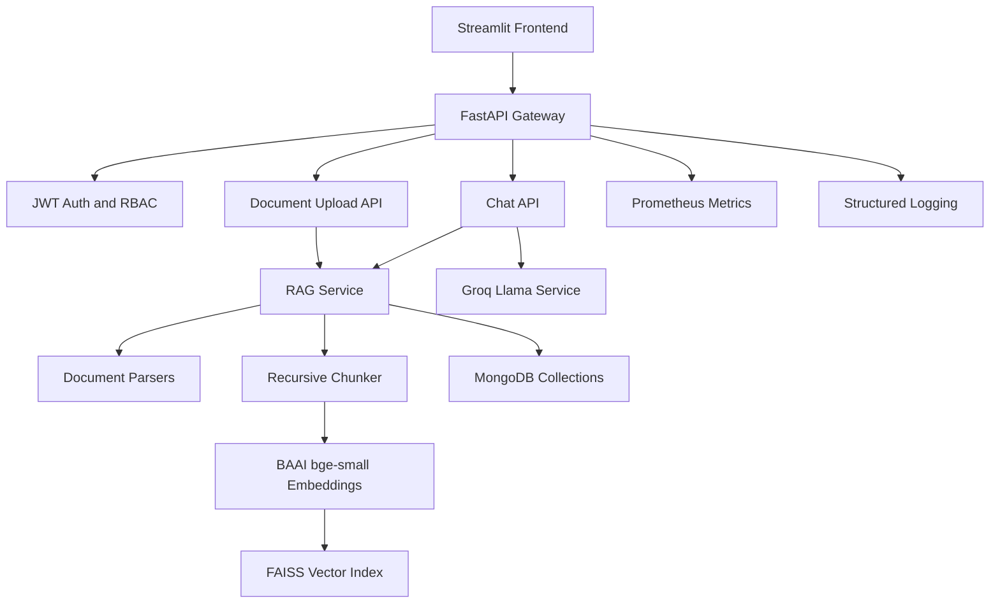

# MediAI

Enterprise AI Medical Assistant powered by Retrieval-Augmented Generation.

MediAI lets doctors, medical students, and patients upload medical PDFs, prescriptions, lab reports, DOCX files, and text notes, then ask grounded questions with source citations, chat history, role-based access, multilingual answers, and admin analytics.

## Architecture



## Features

- Secure auth: register, login, logout, refresh, forgot/reset password, email verification token, bcrypt hashing, protected routes, and doctor/patient/admin roles.
- RAG: PDF, DOCX, and TXT ingestion, recursive chunking, Hugging Face embeddings, FAISS vector search, top-k retrieval, context-aware prompts, source citations, and hallucination-reduction instructions.
- Chat: ChatGPT-style Streamlit UI, streaming responses, markdown rendering, typing animation, conversation memory, rename, delete, pin, search, export, and persisted history.
- Medical intelligence: disease explanations, prescription explanation, lab report analysis, summarization, health tips, diet suggestions, emergency red flags, and medical disclaimer.
- Admin and analytics: total users, active users, uploaded files, query trends, token usage, storage usage, most asked questions, top diseases, top medicines, response time, and API metrics.
- Production foundation: async FastAPI, MongoDB Atlas support, Docker Compose, Prometheus metrics, GitHub Actions, Azure App Service startup, CORS, rate limiting, secure headers, and validation.

## Quick Start

```bash
cp .env.example .env
# Set SECRET_KEY and GROQ_API_KEY in .env
docker compose up --build
```

- Frontend: `http://localhost:8501`
- Backend API: `http://localhost:8000`
- Swagger: `http://localhost:8000/docs`
- Metrics: `http://localhost:8000/metrics`
- Prometheus: `http://localhost:9090`

For production-style local execution with MongoDB Atlas:

```bash
docker compose -f docker-compose.prod.yml up --build
```

## Local Backend Development

```bash
python -m venv .venv
.venv\Scripts\activate
pip install -r requirements.txt
set SECRET_KEY=local-secret-key-with-more-than-32-characters
set MONGODB_URI=mongodb://localhost:27017
set GROQ_API_KEY=your-groq-key
uvicorn app.main:app --app-dir backend --reload
```

## Local Frontend Development

```bash
cd frontend
pip install -r requirements.txt
streamlit run app.py
```

## Create Admin User

```bash
set PYTHONPATH=backend
set ADMIN_EMAIL=admin@mediai.local
set ADMIN_PASSWORD=AdminPassword123
python scripts/create_admin.py
```

## Test

```bash
set SECRET_KEY=test-secret-key-with-more-than-32-characters
pytest backend/tests
coverage run -m pytest backend/tests
coverage report
```

## MongoDB Atlas

Create a free Atlas cluster, add the application IP allowlist, create a database user, and set:

```env
MONGODB_URI=mongodb+srv://<user>:<password>@<cluster>.mongodb.net/?retryWrites=true&w=majority
MONGODB_DATABASE=mediai
```

## CI/CD

- `.github/workflows/ci.yml` runs tests, coverage, and Docker image builds.
- `.github/workflows/azure-deploy.yml` builds, pushes, and deploys backend/frontend containers when repository variable `AZURE_DEPLOY_ENABLED=true` and the documented Azure secrets are configured.

## Safety

MediAI provides educational and document-grounded medical information. It does not diagnose, prescribe, or replace licensed clinicians. Prompts require red-flag guidance and a professional-care disclaimer in medical answers.
