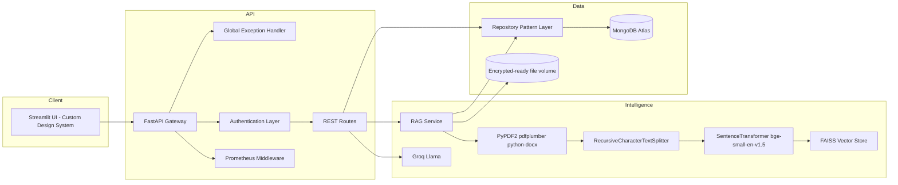
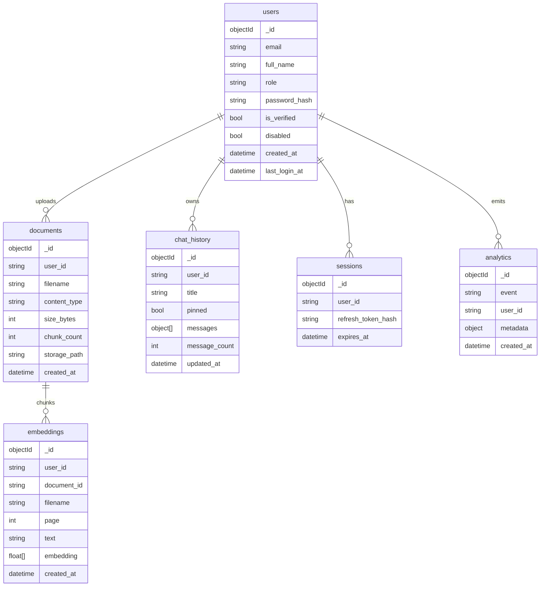

# MediAI Architecture

MediAI is built as an enterprise-grade healthcare SaaS product, utilizing a robust, scalable architecture with separation of concerns.

## Component Diagram

## ER Diagram

## Key Architectural Decisions

1. **Repository Pattern**: All MongoDB queries are abstracted through a repository layer (e.g., `UserRepository`, `BaseRepository`) ensuring separation of concerns between business logic and database operations.
2. **Global Exception Handling**: FastAPI utilizes a global exception handling middleware that catches `HTTPException`, `RequestValidationError`, and unhandled `Exception`s, standardizing error output to a strict JSON structure for predictable frontend consumption.
3. **Robust Data Validation**: Comprehensive Pydantic V2 schemas enforce strict data validation, character length constraints, and password complexity requirements before requests hit the business logic.
4. **FAANG-grade UI**: The Streamlit interface uses injected CSS tokens, customized DOM component mapping, and semantic HTML builders to completely overwrite standard generic elements into a premium, responsive ChatGPT-style UI.

## Request Flow

1. User authenticates through `/api/v1/auth/login`.
2. Frontend stores JWT access and refresh tokens in Streamlit session state.
3. Uploaded files are validated, stored, parsed, chunked, embedded, and indexed in FAISS.
4. Chat requests retrieve relevant chunks via `VectorStore`, build a cautious medical prompt, call Groq LLM, persist the conversation via `Repository`, and return streaming citations.
5. Global middlewares handle Rate Limiting (SlowAPI), Metrics (Prometheus), Request ID tracing, and Security Headers.
